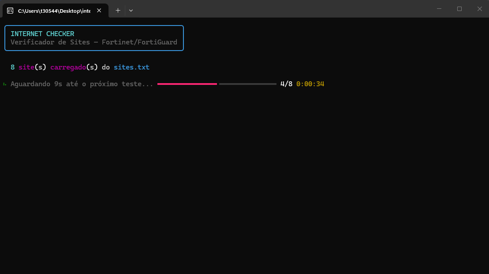
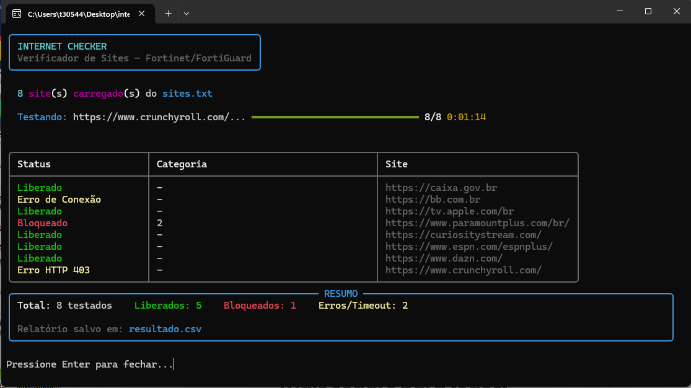
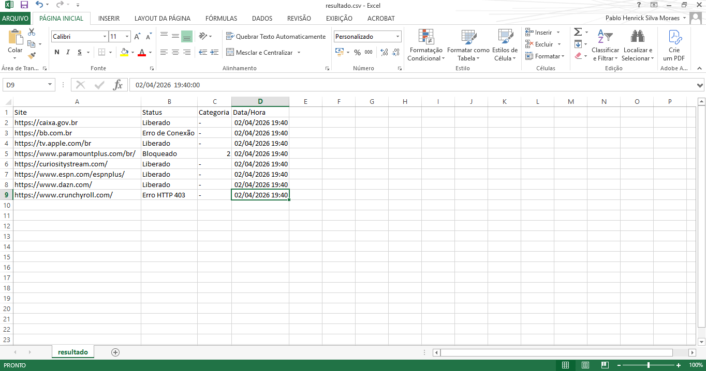

# 🌐 Firewall Site Checker

> Automatize a verificação de sites bloqueados, liberados ou inacessíveis em ambientes corporativos com firewall — sem abrir nenhum navegador.


---

## 🎯 O problema que isso resolve

Em ambientes corporativos com firewall, verificar se um site está liberado, bloqueado ou inacessível é uma tarefa repetitiva e manual.

Abrir o navegador → testar site por site → anotar o resultado → repetir 50, 100, 148 vezes.

**O Firewall Site Checker automatiza tudo isso em um clique duplo.**

---

## ✨ O que ele faz

- ✅ Testa cada site da sua lista automaticamente
- 🔴 Detecta páginas de bloqueio do Fortinet/FortiGuard
- 📂 Captura a **categoria do bloqueio** (incluindo filtros customizados como `CUSTOM_RH`)
- 🟡 Identifica timeouts e erros de conexão
- 📊 Gera um relatório `.csv` pronto para abrir no Excel
- ⏱️ Delay configurável entre testes (evita alertas no firewall)
- 💻 Interface visual com barra de progresso, countdown e tabela colorida

---

## 📸 Demonstração

### Execução em tempo real


### Resultado final com tabela


### Relatório CSV no Excel


---

## 🚀 Como usar

### Opção 1 — Executável (.exe) — recomendado
> Não precisa ter Python instalado. Funciona em qualquer máquina Windows.

1. Baixe o `InternetChecker.exe` e o `sites.txt` da pasta [`/dist`](./dist)
2. Coloque os dois arquivos na **mesma pasta**
3. Edite o `sites.txt` com os sites que deseja testar
4. Clique duas vezes no `InternetChecker.exe`
5. Aguarde a execução — o `resultado.csv` será gerado na mesma pasta

### Opção 2 — Script Python (.bat)
> Requer Python 3.8+ instalado.

```bash
# Clone o repositório
git clone https://github.com/PabloHenrickk/firewall-site-checker.git
cd firewall-site-checker

# Instale as dependências
pip install -r requirements.txt

# Execute
python tester.py
```
Ou clique duplo no `rodar.bat`.

---

## 📋 Configurando os sites

Edite o arquivo `sites.txt` — um site por linha:

```
# Streaming
https://www.netflix.com
https://www.youtube.com

# Redes Sociais
https://www.instagram.com
https://www.tiktok.com
```

- Linhas começando com `#` são **comentários** (ignoradas pelo script)
- Pode escrever com ou sem `https://` — o script completa automaticamente

---

## 📊 Resultados possíveis

| Status | Significado |
|--------|-------------|
| `Liberado` | Site acessível normalmente |
| `Bloqueado` | Firewall bloqueou — categoria capturada automaticamente |
| `ERR_TIMED_OUT` | Site não respondeu no tempo limite |
| `Erro de Conexão` | Sem rota para o host |
| `Erro SSL` | Problema de certificado (comum com inspeção SSL corporativa) |
| `Erro HTTP 4xx` | Servidor recusou o acesso |

---

## ⚠️ Atenção — relatório CSV

O arquivo de saída é sempre salvo como `resultado.csv`.

**Cada nova execução sobrescreve o anterior.**

> 💡 Se quiser manter o histórico, renomeie o arquivo antes de rodar novamente.
> Exemplo: `resultado_01-04-2026.csv`

---

## ⚙️ Configurações (tester.py)

```python
TIMEOUT = 10   # Tempo máximo de espera por site (segundos)
DELAY   = 10   # Pausa entre cada teste (evita alertas no firewall)
```

Aumente o `TIMEOUT` se sua rede for lenta.
Aumente o `DELAY` se quiser mais discrição nos testes.

---

## 🏗️ Estrutura do projeto

```
firewall-site-checker/
├── tester.py           # Script principal
├── sites.txt           # Lista de sites para testar
├── requirements.txt    # Dependências Python
├── rodar.bat           # Atalho para execução via .bat
├── build.bat           # Gera o .exe via PyInstaller
├── dist/
│   └── InternetChecker.exe   # Executável standalone
└── prints/             # Screenshots para documentação
```

---

## 🛠️ Tecnologias utilizadas

- [Python 3.8+](https://www.python.org/)
- [requests](https://pypi.org/project/requests/) — requisições HTTP
- [rich](https://github.com/Textualize/rich) — interface visual no terminal
- [PyInstaller](https://pyinstaller.org/) — geração do executável

---

## 🔧 Gerando o executável

Se quiser recompilar o `.exe` após modificar o script:

```bash
pip install pyinstaller rich
```

Clique duplo no `build.bat` — o executável será gerado em `dist/InternetChecker.exe`.

---

## 🤝 Contribuindo

Encontrou um bug? Quer adicionar suporte para outro firewall? Abra uma [issue](https://github.com/PabloHenrickk/firewall-site-checker/issues) ou envie um Pull Request.

Sugestões de melhorias são bem-vindas.

---

## 📄 Licença

MIT License — veja o arquivo [LICENSE](./LICENSE) para detalhes.

---

## 👤 Autor

**Pablo Henrick**

[](https://https://www.linkedin.com/in/pablohenrick)
[](https://github.com/PabloHenrickk)

---

> Projeto desenvolvido a partir de um problema real em ambiente corporativo.
> Feito para quem trabalha com TI, redes e segurança da informação.
